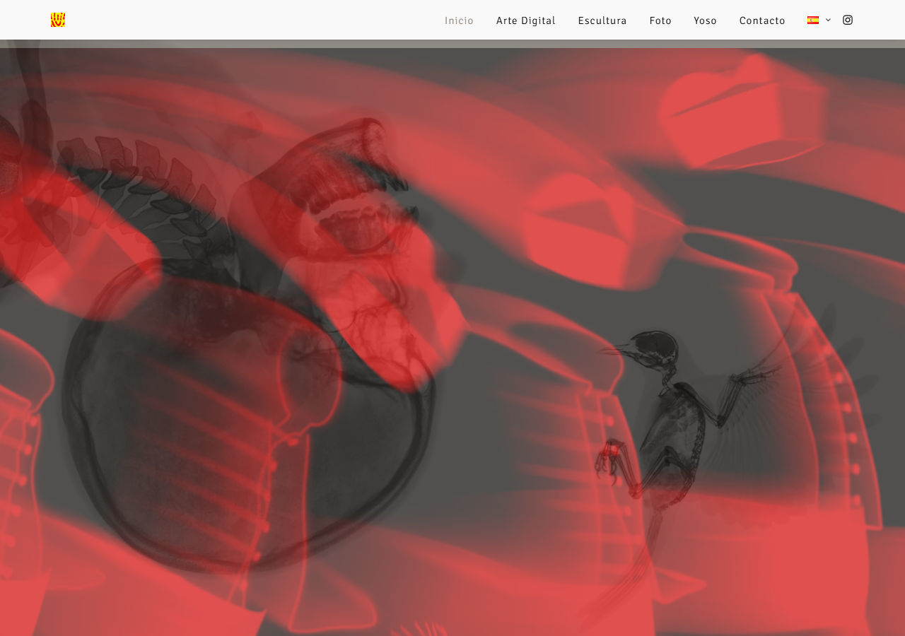
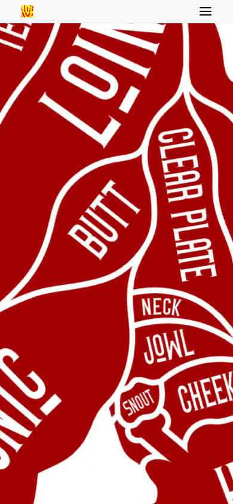
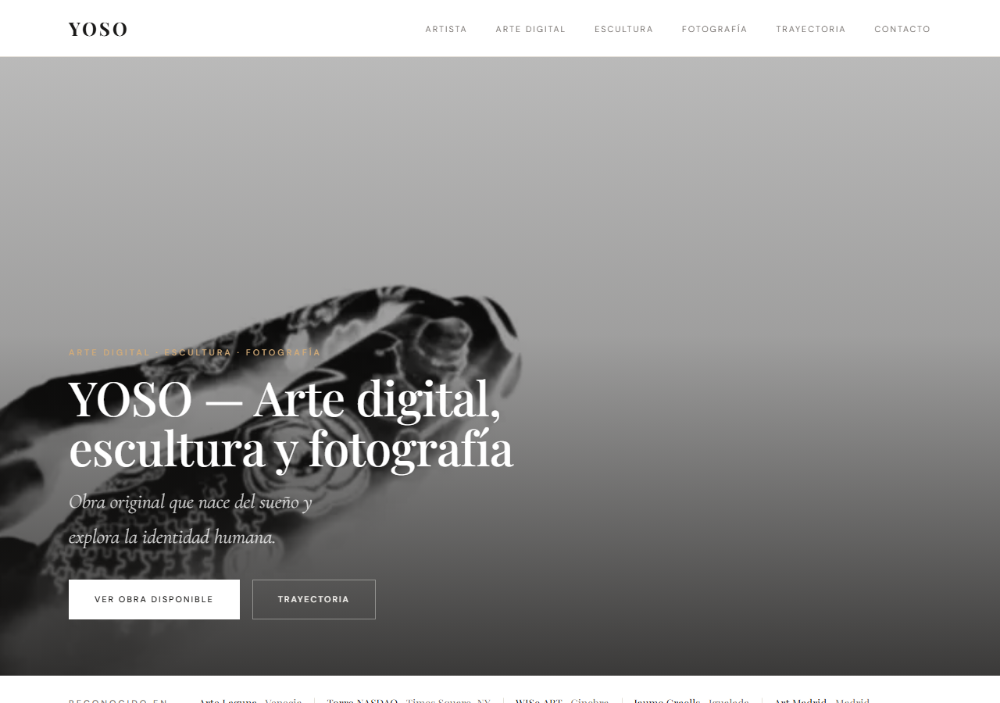
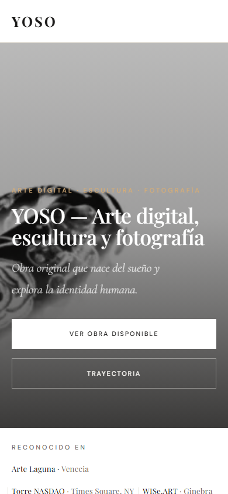
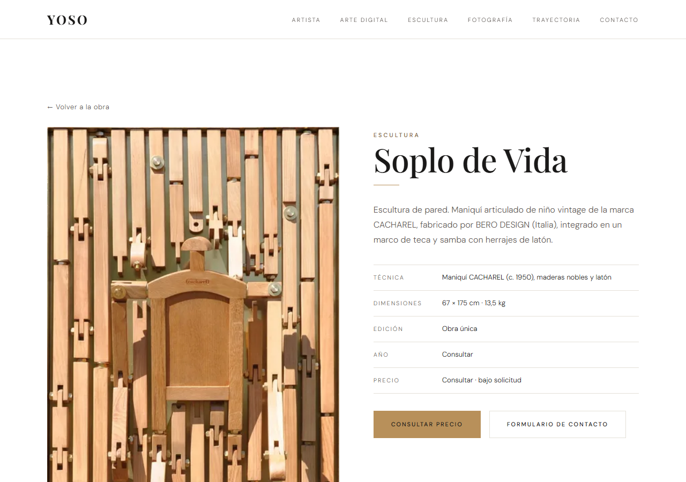
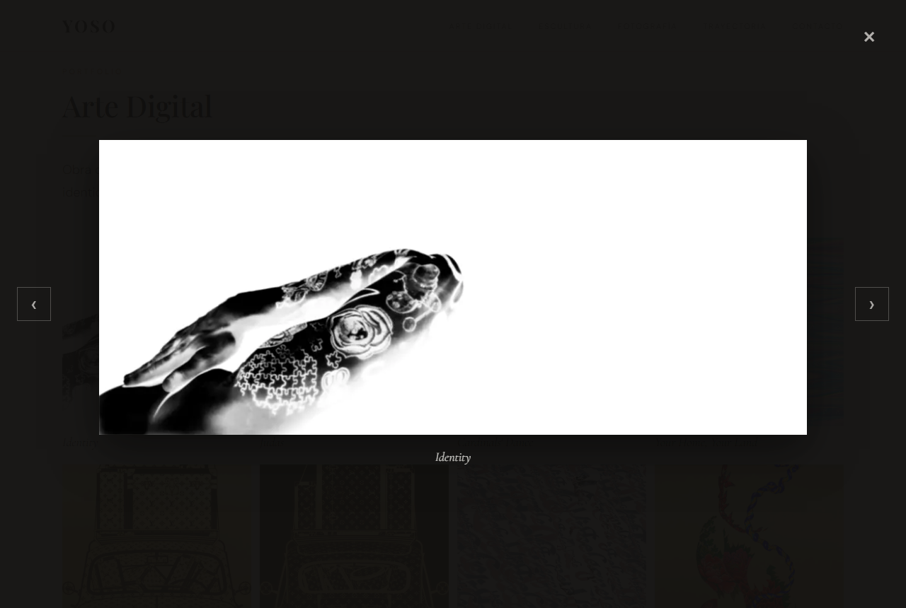
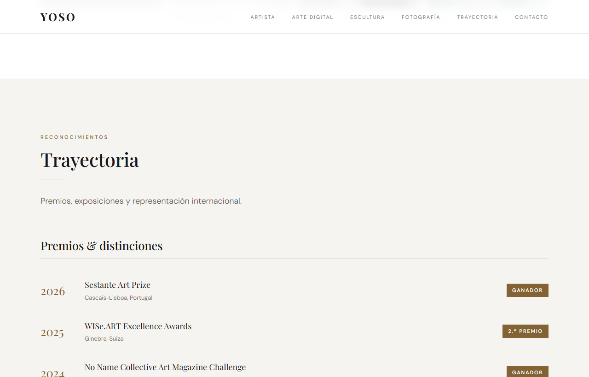
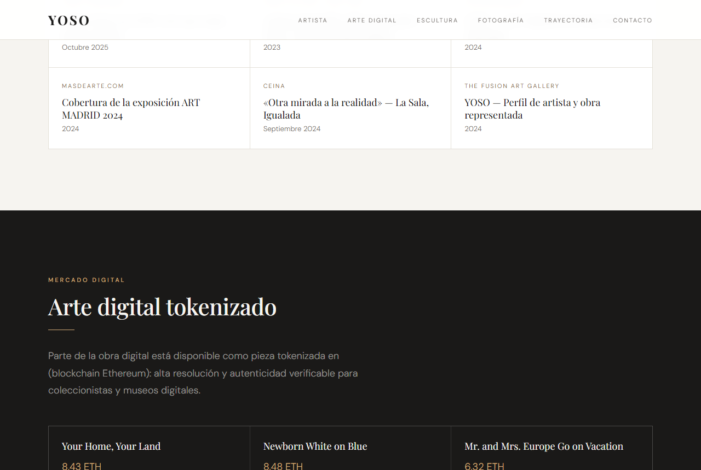

# Informe final — Yoso Art Web

Reconstrucción estática de la web del artista **YOSO** aplicando las recomendaciones de la
auditoría de negocio y la auditoría SEO. Rama de trabajo: `mejoras/auditoria`.

## 1. Resumen

Se ha construido desde cero un sitio estático (HTML5 semántico + CSS + JS vanilla, sin
build de runtime) que sustituye la experiencia del WordPress actual por un activo orientado a
**autoridad artística y conversión**, fiel a la identidad de marca (Playfair Display +
Cormorant Garamond + DM Sans; paleta blanco/crema/negro cálido/oro).

Páginas: `index.html` (home), `sobre-yoso.html` (bio) y 6 fichas de obra
(`obra-*.html`). Infra SEO: `robots.txt`, `sitemap.xml`, favicon, Open Graph propia y
datos estructurados (Person, ProfilePage, FAQPage, VisualArtwork).

## 2. Antes / después

### Web actual (antes) — yoso.art (WordPress + Uncode)
| Escritorio | Móvil |
|---|---|
|  |  |

Slider sin H1 ni propuesta de valor, sin credenciales visibles, sin precios ni fichas.

### Build nuevo (después)
| Escritorio | Móvil |
|---|---|
|  |  |

Hero con propuesta de valor + CTA, barra de reconocimientos, galerías con lightbox,
trayectoria, FAQ, newsletter y formulario. Secciones clave:

- Ficha de obra: 
- Lightbox accesible: 
- Trayectoria: 
- Arte tokenizado (WISe.ART): 

## 3. Métricas Lighthouse (móvil)

| Categoría | Antes (yoso.art) | Después (build) |
|---|---|---|
| Rendimiento | 68 | **95** |
| Accesibilidad | 100 | **100** |
| Buenas prácticas | 96 | **100** |
| SEO | 92 | **100** |

CWV: LCP 6,0→**2,8 s** · Speed Index 6,1→**1,8 s** · TBT 70→**0 ms** · CLS 0.
(Detalle: [`lighthouse/resumen.md`](lighthouse/resumen.md).)

## 4. Recomendaciones aplicadas (mapa)

### Auditoría SEO
| Recomendación | Estado |
|---|---|
| §1 Meta description en todas las páginas | ✅ única por página (150–160 car.) |
| §2 H1 + jerarquía de encabezados | ✅ un H1 por página, H2/H3 sin saltos |
| §3 Open Graph + Twitter Cards | ✅ + imagen OG 1200×630 propia |
| §4 Datos estructurados | ✅ Person, ProfilePage, FAQPage, VisualArtwork |
| §5 Title único con keyword | ✅ 50–60 car., único por página |
| §Imágenes (alt vacío) | ✅ alt descriptivo en las 55 obras; WebP + lazy |
| §Enlaces (`rel="noopener"`, /tienda 404) | ✅ noopener en externos; sin enlaces rotos |
| §Técnico (favicon, sitemap, robots, CWV) | ✅ favicon real, sitemap/robots propios, CWV en verde |
| §Contenido (texto escaso) | ✅ bio >300 palabras + textos de sección |

### Auditoría de negocio
| Recomendación | Estado |
|---|---|
| §3 Credenciales/premios invisibles | ✅ barra de reconocimientos + trayectoria + stats |
| §4 Copyright © 2022 | ✅ © 2026 |
| §5 Ficha técnica de obra | ✅ 6 fichas (técnica/dimensiones/edición/año/precio) |
| §6 Hero sin propuesta de valor | ✅ hero reescrito + CTA principal |
| §7 Newsletter de captación | ✅ "aviso de nueva obra disponible" |
| §8 / §12 WISe.ART (blockchain) | ✅ sección "Arte digital tokenizado" |
| §copy CTA de contacto | ✅ formulario + "Consultar precio" por obra |
| §10 Rendimiento | ✅ imágenes optimizadas, CWV en verde |
| Analítica de eventos | ✅ GA4 + eventos clave (pendiente ID real) |

## 5. Pendientes / próximos pasos

1. **Decisiones operativas del artista** (no de código): abrir perfiles en Saatchi Art,
   Artsy y Singulart; estrategia de Instagram/Reels (auditoría de negocio §1, §2, §9).
2. **Backend de formularios**: conectar Formspree/Web3Forms/Brevo (hoy `mailto`).
3. **GA4**: sustituir `GA_ID` en `assets/js/analytics.js` por el ID real.
4. **Precios y fichas reales**: añadir dimensiones, ediciones y precios cuando el artista los
   facilite (hoy "Consultar"); ampliar fichas al resto de obra destacada.
5. **Internacionalización (EN/FR)**: replicar estructura + `hreflang` (Fase 7).
6. **Despliegue**: publicar el estático (GitHub Pages / Netlify / hosting de yoso.art) y
   re-medir Lighthouse en producción.

## 6. Reproducir el build

```bash
npm install                 # sharp (optimización de imágenes)
npm run images              # descarga + optimiza obras y reescribe rutas
node scripts/gen-obras.mjs  # regenera fichas de obra
node scripts/serve.mjs      # sirve en http://localhost:8099 para auditar
```
